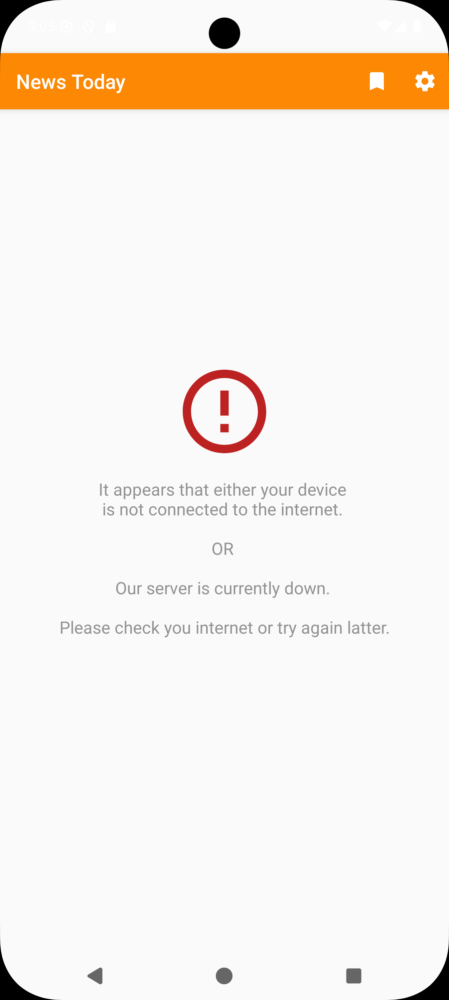
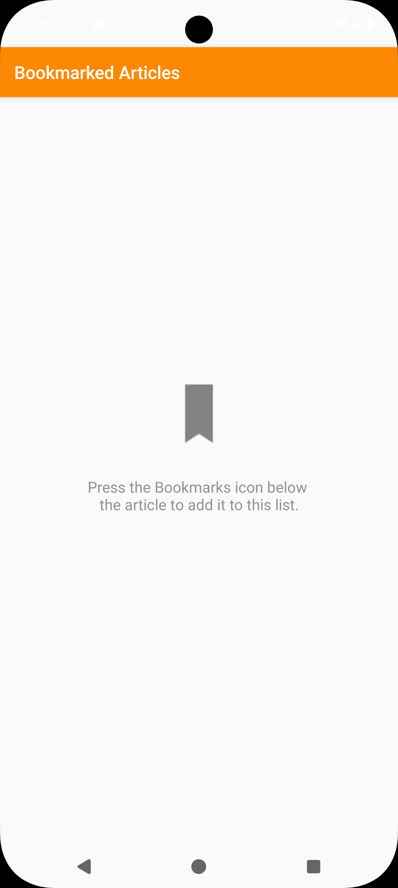
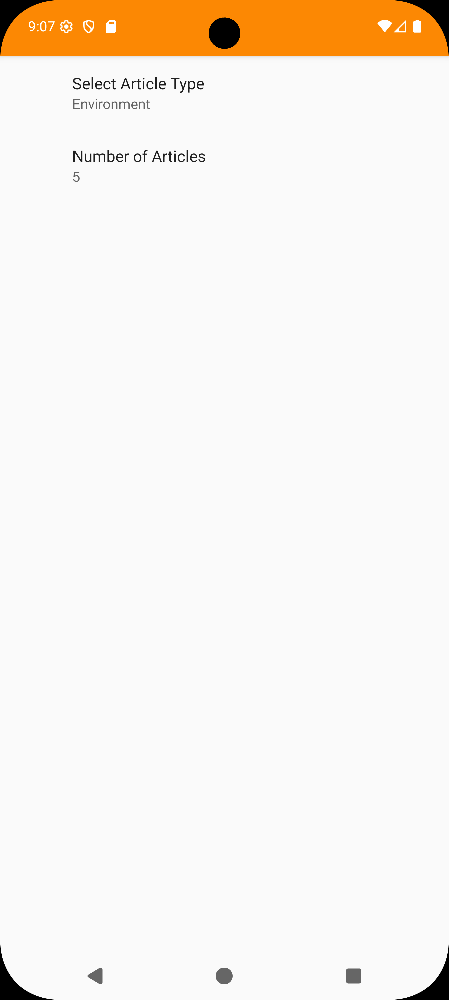

# Adroid App for Latest Local News 📰

[](https://developer.android.com/)
[](https://android-arsenal.com/api?level=28)
[](https://www.java.com/)
[](LICENSE)

A clean, modern Android news app for browsing and bookmarking local news articles with customizable categories and offline reading support.

---

## 🏷️ Keywords & Topics

**Primary Keywords**: Android Development • Mobile App • News Reader • Local News • Java Programming • Material Design

**Technical Stack**: Android SDK • Java • Material Design Components • RecyclerView • SharedPreferences • HTTP Client • Gradle

**App Features**: News Aggregation • Article Bookmarking • Offline Reading • Category Filtering • Pull-to-Refresh • Social Sharing

**Industry Focus**: News & Media • Mobile Applications • Content Management • User Experience • Information Technology • Digital Publishing

---

## Features ✨

- **Multiple News Categories**: Browse articles from Business, Education, Environment, Science, Sports, Technology, Tourism, and World news
- **Bookmark Articles**: Save your favorite articles for offline reading
- **Customizable Settings**: Choose your preferred news categories and number of articles to display
- **Clean Material Design**: Modern, intuitive user interface following Material Design guidelines
- **Pull-to-Refresh**: Easy content updates with swipe gesture
- **Share Articles**: Share interesting news with friends and family
- **Offline Support**: Read bookmarked articles without internet connection

---

## Screenshots 📱

<div align="center">
  
  
  
</div>

> **Screenshots showcase**: No internet connection handling, empty bookmarks state, and settings configuration.

---

## Tech Stack 🛠️

- **Language**: Java
- **Platform**: Android (API 28+)
- **Architecture**: MVC Pattern
- **UI Framework**: Material Design Components
- **Networking**: HTTP URL Connection
- **Data Storage**: SharedPreferences for settings, local storage for bookmarks
- **Build System**: Gradle

---

## Dependencies 📦

- AndroidX AppCompat
- Material Design Components
- SwipeRefreshLayout
- Preference Library
- Loader Library
- ConstraintLayout

---

## Installation 🚀

### Prerequisites
- Android Studio Arctic Fox or later
- Android SDK API 28 or higher
- Java 17 and higher
- Free API key from [The Guardian Open Platform](https://open-platform.theguardian.com/access/)

### Setup
1. Clone the repository:
   ```bash
   git clone https://github.com/sandesha21/newstoday-android.git
   ```

2. Open the project in Android Studio

3. **Configure API Key** (Required - App won't work without this):
   - Visit [The Guardian Open Platform](https://open-platform.theguardian.com/access/)
   - Click "Register developer key" (free for non-commercial use)
   - Copy your API key (format: `xxxxxxxx-xxxx-xxxx-xxxx-xxxxxxxxxxxx`)
   - In your project root, copy the template file:
     ```bash
     cp gradle.properties.template gradle.properties
     ```
   - Edit `gradle.properties` and replace the placeholder values with your API key parts:
     ```properties
     guard_a=xxxx
     guard_b=xxxxxxxx
     guard_c=xxxx
     guard_d=xxxx
     guard_e=xxxxxxxxxxxx
     ```
   - **Important**: Never commit `gradle.properties` to version control (it's in .gitignore)

4. Sync the project with Gradle files: `File > Sync Now`

5. Run the app on an emulator or physical device

---

## Usage 📖

1. **Browse News**: Launch the app to see the latest news articles
2. **Change Categories**: Go to Settings to select your preferred news categories
3. **Bookmark Articles**: Tap the bookmark icon on any article to save it
4. **View Bookmarks**: Access your saved articles from the bookmarks menu
5. **Share Articles**: Use the share button to send articles to others
6. **Refresh Content**: Pull down on the main screen to refresh articles

---

## Project Structure 📁

```
NewsToday-Android-App/
├── app/src/main/java/com/sandesh/android/newstoday/
│   ├── Article.java              # Article data model
│   ├── ArticleAdapter.java       # RecyclerView adapter for articles
│   ├── ArticleLoader.java        # AsyncTaskLoader for fetching articles
│   ├── Bookmarks.java           # Bookmark data model
│   ├── BookmarksActivity.java   # Activity for displaying bookmarked articles
│   ├── NewsActivity.java        # Main activity
│   ├── QueryUtils.java          # HTTP request utilities
│   ├── SettingsActivity.java    # Settings configuration activity
│   └── Utils.java              # General utility functions
├── app/src/main/res/            # App resources (layouts, drawables, strings)
├── screenshots/                 # App screenshots for documentation
├── README.md                    # Project documentation
├── PROJECT_DESCRIPTION.md       # Detailed project description
└── LICENSE                      # MIT License
```

---

## API Integration 🌐

The app fetches news data from a REST API. Make sure to:
- Configure your API endpoints in the appropriate utility classes
- Handle network errors gracefully
- Implement proper JSON parsing for article data

---

## Contributing 🤝

1. Fork the repository
2. Create a feature branch (`git checkout -b feature/amazing-feature`)
3. Commit your changes (`git commit -m 'Add some amazing feature'`)
4. Push to the branch (`git push origin feature/amazing-feature`)
5. Open a Pull Request

---

## License 📄

This project is licensed under the MIT License - see the [LICENSE](LICENSE) file for details.

---

## Acknowledgments 🙏

- Material Design Icons
- AndroidX Libraries
- News API providers

---

## 👨‍💻 Author  
**Sandesh S. Badwaik**  

[](https://www.linkedin.com/in/sbadwaik/)
[](https://github.com/sandesha21)

---

⭐ Star this repository if you found it helpful!